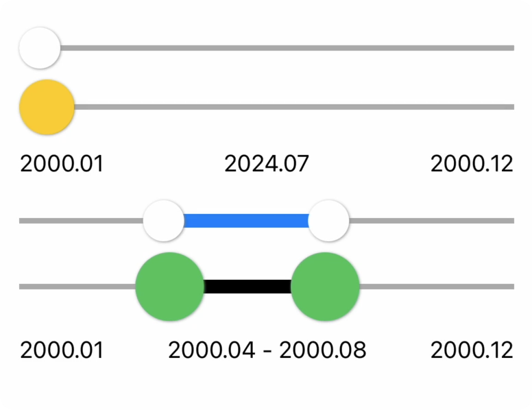

# WZDateSlider


## Installation

### SPM
https://github.com/wannabewize/WZDateSlider.git, Up to Major: 1.0

## Sample Code

### Single Date Slider

```
WZSingleDateSlider(date: $date, minDate: minDate, maxDate: maxDate)

WZSingleDateSlider(date: $date, minDate: minDate, maxDate: maxDate, thumbSize: 40, thumbColor: .yellow, progressColor: .brown)
```


### Double Date(Range) Slider

```
WZDoubleDateSlider(lowDate: $lowValue, highDate: $highValue, minDate: minDate, maxDate: maxDate)

WZDoubleDateSlider(lowDate: $lowValue, highDate: $highValue, minDate: minDate, maxDate: maxDate, thumbSize: 50, thumbColor: .green, progressColor: .black)
```

## Preview



<video src="https://github.com/wannabewize/WZDateSlider/blob/develop/Resources/demo.mov"></video>